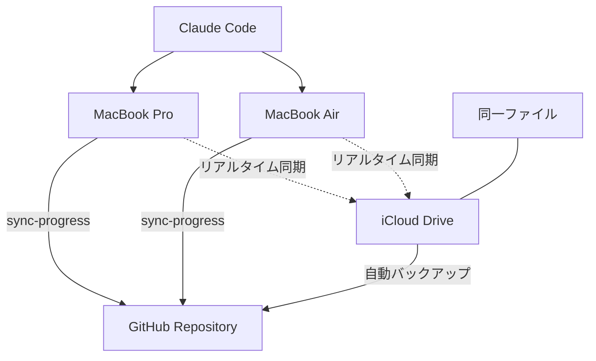

# MacBook Air環境構築記録

## 実施内容

### Claude Codeのセットアップ
1. ✅ Claude Code インストール済み
2. ✅ Claude Pro アカウントでログイン完了
3. ✅ ターミナル設定（Shift+Enter改行）適用
4. ✅ セットアップドキュメント自動生成

### 作成されたセットアップファイル
- **保存先**: `/Users/taotokui_1/Desktop/MACBOOK-AIR-SETUP.md`
- **内容**: プロジェクトクローン、エイリアス設定、依存関係インストール手順

## マルチデバイス戦略（改訂版）

### 🔄 戦略変更の経緯
**変更理由**: 同じApple IDでログインしているため、iCloud Drive直接参照が最適
**変更日**: 2025年6月7日 21:45
**結論**: GitHubクローン方式 → iCloud Drive共有方式に変更

### デバイス役割分担（統一版）

#### [[MacBook Pro]]（メイン機）
- 🏠 **用途**: 主要開発・実装作業
- 📁 **場所**: `~/Library/Mobile Documents/com~apple~CloudDocs/Knowledge-Base/task-manager`
- ☁️ **特徴**: iCloud Drive管理、[[ナレッジグラフ]]フル機能
- 🔧 **機能**: 重い処理、複雑な実装、新機能開発

#### [[MacBook Air]]（サブ機）
- 🚀 **用途**: 外出先での進捗確認・軽微な修正
- 📁 **場所**: `~/Library/Mobile Documents/com~apple~CloudDocs/Knowledge-Base/task-manager`（同一パス）
- ☁️ **特徴**: iCloud Drive直接参照、リアルタイム同期
- ✏️ **機能**: 進捗更新、ドキュメント編集、ナレッジ追加

### 同期メカニズム（改訂版）



### ワークフロー（改訂版）

1. **どちらのデバイスでも同様**
   - iCloud Drive内の同じファイルに直接アクセス
   - リアルタイムで変更が他デバイスに反映
   - 定期的に`sync-progress`でGitHubにバックアップ

2. **外出先での利用**
   - [[Gemini GitHub連携]]で進捗確認
   - MacBook Airで直接作業（GitHubクローン不要）
   - [[AI駆動プロジェクト管理]]の継続

## 技術的な詳細（改訂版）

### 統一されたパス設定
- **両デバイス共通**: `~/Library/Mobile Documents/com~apple~CloudDocs/Knowledge-Base/task-manager`
- **sync-progressエイリアス**: 両デバイスで同一設定
- **メリット**: 設定の重複なし、管理の簡素化

### 改訂後のMacBook Air設定コマンド
```bash
# iCloud Drive内のプロジェクトに直接アクセス
cd ~/Library/Mobile\ Documents/com~apple~CloudDocs/Knowledge-Base/task-manager

# 同一のsync-progressエイリアス設定
echo 'alias sync-progress="cd ~/Library/Mobile\ Documents/com~apple~CloudDocs/Knowledge-Base/task-manager && git add . && git commit -m \"WIP: $(date +%Y-%m-%d\ %H:%M)\" && git push"' >> ~/.zshrc
source ~/.zshrc

# 依存関係インストール
npm install
```

### Claude Code共有
- 同一Claude Proアカウント
- 設定・履歴の共有
- シームレスな作業継続

## 今後の展開
- [ ] 実際のクローン作業（サブ機）
- [ ] 同期テスト
- [ ] 外出先での動作確認
- [ ] ワークフローの最適化

#環境構築 #マルチデバイス #MacBookAir #同期 #Claude